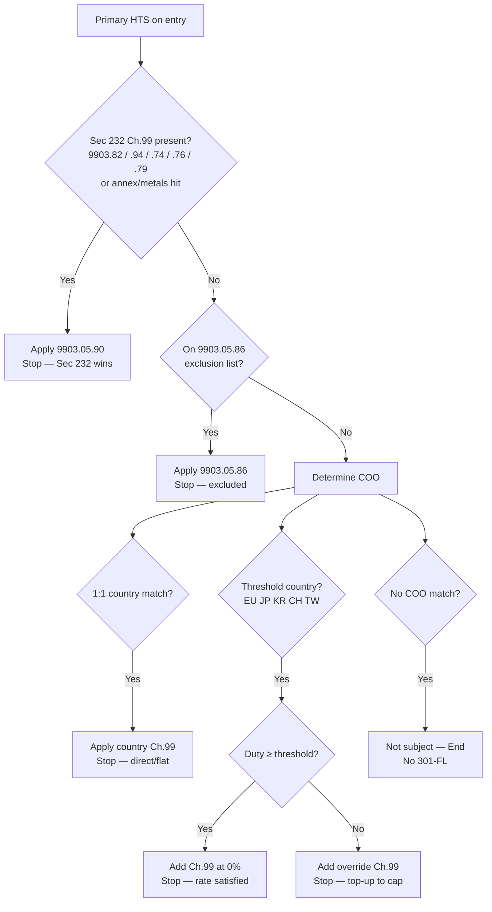

# KlearNow Tariff Rules Framework (shareable)

**Version 1.3.0 · as of 2026-08-05 · US jurisdiction**  
**Status:** Interim pack for **other apps** until the core Duty-stack engine is exposed as a **shared API**.

| Artifact | Path |
|----------|------|
| **This guide** | `tariff-rules/docs/FRAMEWORK.md` |
| **Machine contract** | [`../data/framework_contract.json`](../data/framework_contract.json) |
| Narrative / inventory | [`RULES_ENGINE.md`](./RULES_ENGINE.md), [`RULES.md`](./RULES.md), [`OPEN_ITEMS.md`](./OPEN_ITEMS.md) |
| Live data | `tariff-rules/data/*.json` |

Pin results to **`framework_contract.version`** + backend **`rulepack.hash`** when you share assessments across apps.

---

## 1. Why this exists

Other KlearNow apps (Inditex Audit, playground tools, ES-003 reviewers, WordPress Duty stack) need one stacking truth:

1. **Today:** copy or reference this framework + `data/` packs (or call the local Tariff API when available).
2. **Soon:** same contract served by a shared **KlearNow Tariff Rules API** (playground / engine). Do **not** fork rates into each app.

### Safety (non-negotiable)

1. Never hardcode a rate — use `data/` or the API.
2. Non-`CONFIRMED` codes do not compute silently.
3. Trade-deal **totals blocked** until R6 is resolved.
4. IEEPA / Section 122 rejected outside their eras.
5. 232 metals use metal-content where required; autos need **annex membership** (not chapter triage alone).

---

## 2. What to ship to another app

Minimum share set:

```
tariff-rules/
  docs/FRAMEWORK.md          ← this file
  data/framework_contract.json
  data/program_status.json
  data/interaction_rules.json
  data/ch99_codes.json
  data/s301fl_pack.json
  data/s301_brazil.json
  data/s232_auto_parts_annex.json
  data/s301_china_lists.json
  data/ch99_rules.json       ← if using ch99 engine
  data/hts_rates.json        ← Column-1 (large; optional if API supplies col-1)
```

Optional: point them at HTTP preview (when Tariff backend is up):

| Endpoint | Use |
|----------|-----|
| `GET /health` | Liveness |
| `GET /v1/config` | Surface / Auth0 / quotas |
| `GET /v1/hts/{hts}?as_of=` | Col-1 + `s232_auto_parts` annex hit |
| `POST /v1/entries:assess` | Full stack |
| `POST /v1/entries:audit` | Filed vs required |
| `GET /v1/openapi.json` | Contract |

Auth preview: `X-API-Key: dev-internal` (local) or Auth0 Bearer (playground).

---

## 3. Filing eras (rate-determination date)

Inclusive calendar days. Entry Date is the usual proxy (19 CFR 141.68 / 141.69).

| Era | Dates | Primary | Ch.99 |
|-----|-------|---------|-------|
| IEEPA | 2025-02-04 → **2026-02-23** | CAPE / refund only | `9903.01` / `.02` |
| Section 122 | **2026-02-24** → **2026-07-23** | 10% surcharge (**entry-level**) | `9903.03.01` |
| **301-FL** | from **2026-07-24** | Forced Labor 301 | `9903.05.xx` |

Wrong-era filings (e.g. IEEPA after 2026-02-23, Sec 122 on/after 2026-07-24) are **ERROR**s.

---

## 4. Stacking (R1–R9)

Authoritative copies: `interaction_rules.json` + `framework_contract.json`.

| Id | Rule |
|----|------|
| **R1** | 232 and 301-FL mutually exclusive — **232 wins** → `9903.05.90` |
| **R2** | China 301 (`9903.88.xx`) **not** suppressed by 232 or Sec 122; reports first |
| **R2b** | Sec 122 does **not** stack with 232 → `9903.03.06`, suppress `9903.03.01` |
| **R2c** | Brazil 301 (`9903.05.01` @ 25%) **stacks** with 301-FL (`9903.05.27`); 232 → Brazil exempt `.07` + FL `.90` |
| **R3** | JP 232 top-up to 15% (`9903.94.43`) when col-1 &lt; 15% |
| **R4a/b** | Metals: `9903.82.02` @ 50% metal-content; `9903.82.09` @ 25% entered value |
| **R4c** | Sec 122 is **entry-level** (any ESL of the Entry Summary Number) |
| **R5** | Metals vs autos on Ch.73/74 — **TBC** |
| **R6** | Trade-deal MFN cap — **BLOCKING** for totals |
| **R8** | HTS authority: Item Master for parts |
| **R9** | AD/CVD outside Ch.99 math |

CBP reporting: Ch.99 before Ch.1–97; China 301 before 232 when both apply.

---

## 5. Section 232 auto-parts annex

Pack: `s232_auto_parts_annex.json` (~130 published stems, CBP Attachment 2 / U.S. note 33).

| Behavior | |
|----------|--|
| **In annex** | Auto-apply 232 (`9903.94.05` default) → suppress 301-FL via `9903.05.90` |
| **Off list** | No auto-232; optional `flags.s232_auto_part` = claim-gated warning |
| **In** | e.g. `8544.30.00`, `8708.10.30`, `8708.29` |
| **Out** | e.g. `8544.42.90`, `8544.49`, sign plates `8310…` |

Chapter membership alone is **not** a determination.

---

## 6. 301-FL decision flow (shareable flowchart)

Use when rate date ≥ **2026-07-24** and 232 has not already won. Matches the engine’s intended Chapter 99 selection path (also encoded in `framework_contract.json` → `s301fl_decision_flow`).



Related grace / other exclusions in pack: `9903.05.85`, `9903.05.87` (see `s301fl_pack.json` → `general_exemptions`).

---

## 7. Engines

| Id | When |
|----|------|
| `auto` (default) | Full Duty stack for Inditex / ES-003 / Quick Check |
| `ch99` | Reciprocal / IEEPA-era seed only (`ch99_rules.json`) |

**Minimal assess body** (same shape the future shared API will keep):

```json
{
  "engine": "auto",
  "as_of": "2026-08-04",
  "lines": [
    { "hts": "8708103050", "coo": "DE", "entered_value": 10000 }
  ]
}
```

---

## 8. Integration pattern for other apps

### A. Preferred (when Tariff API is reachable)

```
Your app  →  POST /v1/entries:assess  →  render layers / diagnostics
```

Do not re-implement stacking locally.

### B. Offline / embed (until shared API)

1. Vendor `framework_contract.json` + listed `data/` files at a pinned version.
2. Reuse TypeScript helpers under `tariff-rules/src/` **or** call a sidecar Tariff service.
3. Surface `rulepack.hash` / framework `version` on every exported result.

### C. Do not

- Duplicate rate tables inside Inditex Python / DocAI / RPS.
- Treat UI checkboxes as authority when annex JSON already decides membership.
- Assume EU “10%” or JP “12.5%” without running the threshold/flat path for that COO.

---

## 9. Open blockers (tell downstream apps)

| Id | Impact |
|----|--------|
| **R6** MFN cap | Trade-deal **totals** blocked |
| **R5** metals vs autos | Ch.73/74 edge cases |
| **R7** `9903.94` label | Drawback / legal-basis labeling |

~~Brazil 301 heading~~ resolved: `9903.05.01` (CSMS #69302472).

Full list: [`OPEN_ITEMS.md`](./OPEN_ITEMS.md).

---

## 10. Changelog

| Ver | Date | Notes |
|-----|------|-------|
| **1.3.1** | 2026-08-06 | Brazil Section 301 `9903.05.01` @ 25% wired (CSMS #69302472); stacks with 301-FL; R2c |
| **1.3.0** | 2026-08-05 | Shareable framework + `framework_contract.json`; 232 annex auto-apply; 301-FL flowchart; API preview |
| 1.2.0 | 2026-08-03 | Era stacking contract; Sec 122 entry-level; `9903.82.09` |
| 1.0.x | 2026-07-31 | Initial RULES / program_status cut |

---

*Machine truth: `data/*.json`. If prose and JSON disagree, JSON wins. When the shared Rules API ships, this framework remains the semantic contract behind it.*
