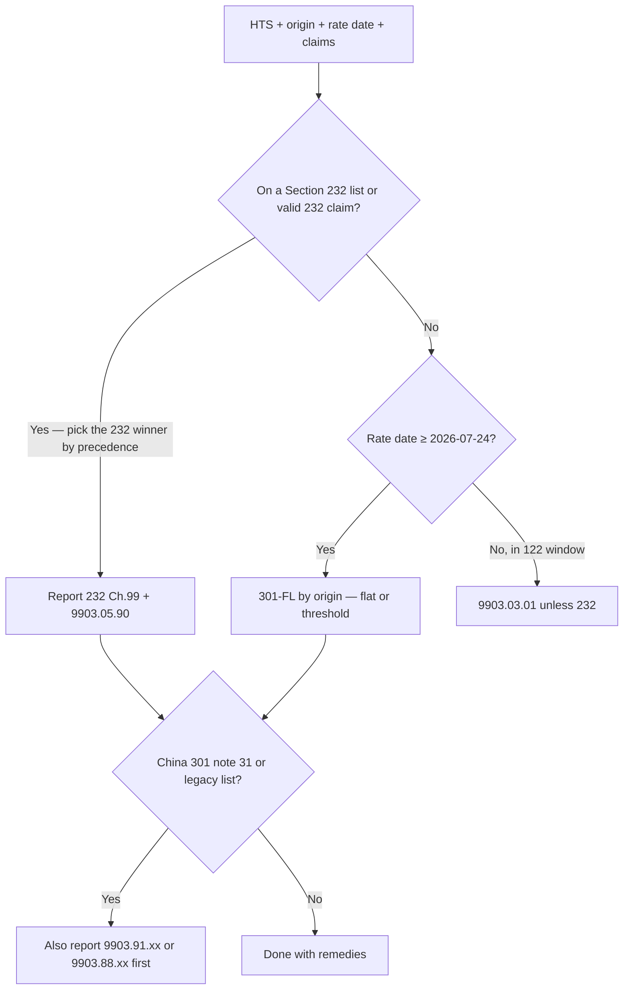
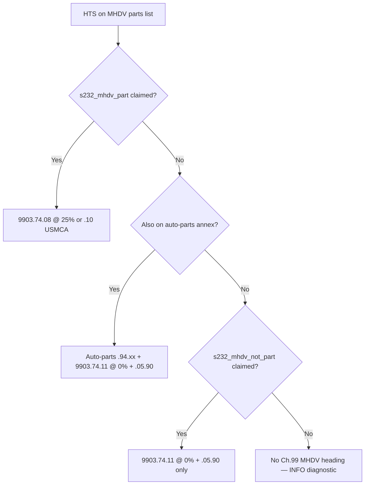
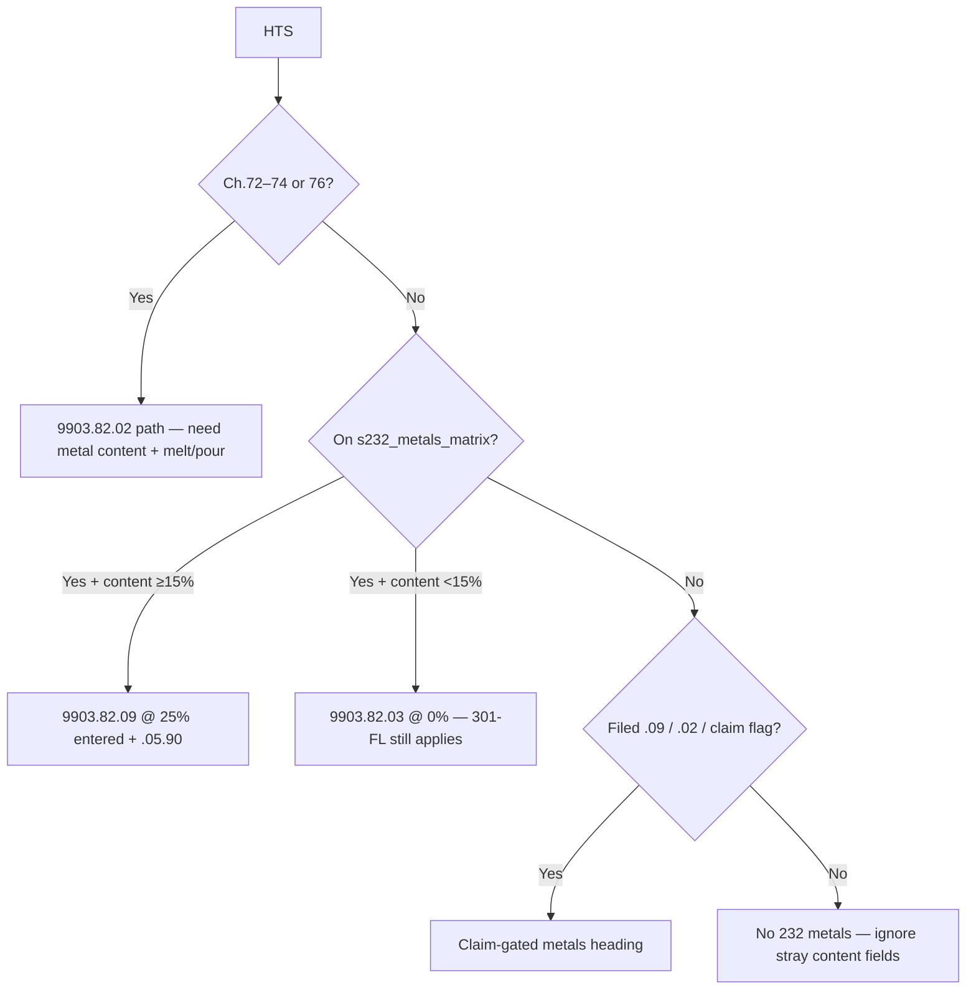
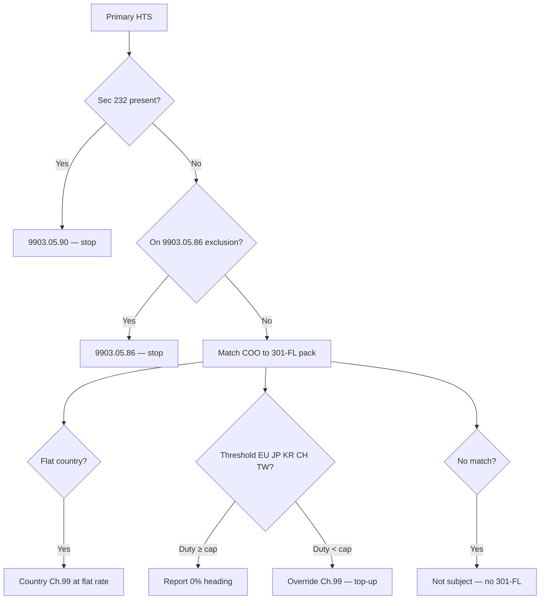

# KlearNow Tariff Stacking Rules — Review Pack

**Version 1.6.3 · as of 2026-08-28 · United States only (HTSUS)**  
**Audience:** developers integrating the engine, and compliance / trade reviewing the logic before it is used in production.

This is the document to **read, mark up, and sign off**. Machine tables in `tariff-rules/data/` are the authority if this prose and a JSON file ever disagree.

Shareable HTML (same content): [`RULES.html`](./RULES.html) — open in a browser or Print → PDF.

| If you are… | Start here | Then check |
|-------------|------------|------------|
| **Compliance / trade** | §1–§3 (what's live), §5 (stacking), §6 (each 232 program + HTS lists) | §8 / §8.1 (China 301 solar + expired CSPV 201), §12 claim flags, §15 open items, **sign-off** at the end |
| **Developer** | §4 decision order, §6.3 MHDV dual-list, §6.6 metals list-gate, §12 flags, §13 data files / API | [`PACK_INTAKE.md`](./PACK_INTAKE.md), `FRAMEWORK.md`, `interaction_rules.json`, tests in `backend/src/s232NewPacks.test.ts` / `ch98Basis.test.ts` |
| **Operator using the app** | [`docs/USER_MANUAL.md`](../../docs/USER_MANUAL.md) | HTS list + Duty stack walkthrough |

Related docs: [`FRAMEWORK.md`](./FRAMEWORK.md) (shareable contract) · [`PACK_INTAKE.md`](./PACK_INTAKE.md) (CSMS → pack completeness) · [`RULES_ENGINE.md`](./RULES_ENGINE.md) (Inditex API hand-off) · [`OPEN_ITEMS.md`](./OPEN_ITEMS.md).

---

## How to review this pack

Please treat every **CONFIRMED** row as “this is what we will file / compute” and every **TBC** row as “do not ship totals / labels until this is closed.”

For each program below, confirm:

1. **Scope** — the HTS list (or claim) is the right trigger; chapter triage alone is not enough for auto parts.
2. **Heading + rate** — the Chapter 99 code and additional rate match CSMS / the proclamation.
3. **Auto vs claim** — the engine should not invent a 25% duty that CBP only assesses when the importer certifies a fact (MHDV part, semiconductor Note 39(b), patented pharma).
4. **Stacking** — 232 suppresses 301-FL (`9903.05.90`); China 301 is **not** suppressed; metals stay on their own value basis.
5. **Era** — IEEPA and Section 122 must not compute forward outside their windows.

Mark the sign-off table at the end when you agree — or file a comment against the rule id (R1, R2, …) or program id (`s232_wood`, etc.).

---

## 1. What this engine does

Given **HTS**, **country of origin**, **entered value**, **mode of transport** (MOT — required for HMF), **rate-determination date** (Entry Date under 19 CFR 141.68 / 141.69), and optional **claims** (232 part, semiconductor params, USMCA, metal content), it returns:

1. Column 1 (Chapters 1–97) duty from the HTS table.
2. The Chapter 99 layers that should report, in CBP order, with rates and reasons.
3. Suppressions (especially 301-FL killed by 232).
4. Diagnostics when a claim is needed, a heading is TBC, or the HTS is unknown.

It does **not** classify the product, invent Column 1 for an unknown 10-digit line, or auto-certify claim-gated facts (Note 39(b) TPP/DRAM, “this is an MHDV part,” patented vs generic pharma).

**Safety (non-negotiable):**

1. Never hardcode a rate in application code — use `data/` or `POST /v1/entries:assess`.
2. Non-`CONFIRMED` codes do not compute silently.
3. Trade-deal **totals** are blocked until R6 (MFN cap) is resolved.
4. IEEPA / Section 122 are rejected outside their eras.
5. 232 metals use metal-content value where required (`9903.82.02`).

---

## 2. Legal landscape — what's alive, what's dead

| Program | Ch.99 family | Status | Compute live? |
|---------|--------------|--------|----------------|
| IEEPA | `9903.01.xx` / `.02.xx` | **Struck down** — SCOTUS 2026-02-20; IEEPA does not authorize tariffs. Did **not** touch 232 or 301. | No (prospective). Historical CAPE / refund only. |
| Section 122 | `9903.03.01` (surcharge) | **Sunset** 12:01 a.m. 2026-07-24 (150-day statutory limit). | Historical only (2026-02-24 → 2026-07-23). |
| **301-FL** | `9903.05.20+` | **Live** from 2026-07-24 (CSMS #69326983). Functional replacement for 122 — no sunset. | Yes |
| Brazil country 301 | `9903.05.01`–`.09` | **Live** from 2026-07-22 @ 25% (CSMS #69302472). Distinct from 301-FL Brazil `.27`. | Yes |
| Legacy China 301 | `9903.88.xx` | **Live.** Not suppressed by 232 or 122. | Yes |
| **China 301 four-year review** | `9903.91.xx` / `9903.92.10` | **Live.** U.S. note 31 / [89 FR 76581](https://www.federalregister.gov/documents/2024/09/18/2024-21217/notice-of-modification-chinas-acts-policies-and-practices-related-to-technology-transfer) / [CSMS #62411889](https://content.govdelivery.com/accounts/USDHSCBP/bulletins/3b85471). Products of China. Replaces `9903.88.xx` on the same HTS. | Yes (HTS + date) |
| 232 auto parts | `9903.94.05` (+ origin splits `.43`/`.53`/`.63`/`.32`) | **Live.** Proclamation 10908 annex. COO may change the heading. | Yes (in-annex auto) |
| 232 passenger vehicles / light trucks | `9903.94.01`–`.04` (+ origin splits `.41`/`.51`/`.61`) | **Live.** CSMS #64624801. COO drives the heading. | Yes (list auto) |
| 232 MHDV / buses / parts | `9903.74.01`–`.11` | **Live.** Proclamation 10984 / CSMS #66665333. | Vehicles/buses auto; **parts claim-gated** |
| 232 wood | `9903.76.xx` | **Live.** Proclamation 10976 / CSMS #66492057. | Yes (list auto) |
| 232 semiconductors | `9903.79.01`–`.09` | **Live.** CSMS #67400472. | **Claim-gated** Note 39(b) |
| 232 metals | `9903.82.xx` | **Live.** Ch.72–74/76 article triage + **Metals HTS List** for derivatives (CSMS #68253075 / **#68855869**). | Yes — **list / chapter**, not content alone on off-list HTS |
| 232 patented pharma | `9903.04.60`–`.67` | **Live.** Proclamation 11020 / CSMS #69395344, #69415934. | **Claim-gated** Ch.29/30 |
| **Section 338 Canada** | `9903.03.12`–`.16` | **Live** from 12:01 a.m. EST **2026-08-22** (CSMS #69606660). Original 2026-08-19 start was suspended 19–21 Aug (Proc. 11056). | Yes (product of Canada + HTS list). Aircraft `.16` is **claim-gated** (`civil_aircraft_gn6`) |
| **Section 201 QSP** | `9903.45.30` / `.31` | **Live** from **2026-08-15** through 2030-08-14 (U.S. note 41). Quartz surface products only (`6810.99.0020` / `.0040` / `7020.00.6000`). **Not** CSPV solar. | Yes (list auto; over-quota claim) |
| Section 201 CSPV (solar) | `9903.45.21`–`.29` | **Expired 2026-02-06.** Do not compute. Replaced by AD/CVD + China 301 Note 31 + 301-FL (and scheduled 232 polysilicon Dec 2026). | **No** |
| Section 201 washers | `9903.45.01`–`.06` | **Expired.** Do not compute. | **No** |
| **232 UAS / drones** | `9903.08.21` / `.22` | **Live** from **2026-09-03** (Proc. 11055 / note 43). Large UAS 100%; small UAS 25%. Suppresses 301-FL. | Yes (list auto; thermal / docking / 8807 claim-gated) |
| JP / EU leftover trade-deal flags | `9903.94.45/.55` | Rate known; **MFN mechanic TBC (R6)** | Rate yes; **totals blocked** |

---

## 3. Filing eras (rate-determination date)

Calendar days are **inclusive**. Entry Date is the usual proxy.

| Era | Dates | Primary layer | Ch.99 |
|-----|-------|---------------|-------|
| Pre-IEEPA | before 2025-02-04 | Baseline / other | — |
| IEEPA | 2025-02-04 → **2026-02-23** | CAPE / refund only | `9903.01` / `.02` |
| Section 122 | **2026-02-24** → **2026-07-23** | 10% surcharge, **entry-level** | `9903.03.01` |
| **301-FL** | from **2026-07-24** | Forced Labor 301 | `9903.05.xx` |

Wrong-era filings (IEEPA after 2026-02-23, Sec 122 on/after 2026-07-24) are **ERROR**s.

Section 232 programs have their own effective dates (vehicles 2025-04-03, auto parts 2025-05-03, wood 2025-10-14, MHDV 2025-11-01, semiconductors 2026-01-15, patented pharma 2026-07-31). The engine will not apply a 232 pack before that pack's effective date.

---

## 4. How a line is decided (plain English)



**Section 232 winner (entered-value programs), highest first:**

1. **Claimed semiconductors** `9903.79.01` (beats autos / MHDV / metals).
2. **MHDV vehicles / buses** (auto from HTS). MHDV **parts** only when claimed — except **dual-list** HTS (annex + MHDV parts): auto-parts wins as primary `hit` and **`9903.74.11`** stacks as `companion` when `s232_mhdv_part` is not claimed (§6.3).
3. **Passenger vehicles / light trucks** (auto from HTS).
4. **Auto-parts annex** (auto) or off-list auto-part **claim**. Chapter 73/74 metals still win over parts (R5 TBC).
5. **Wood** (auto from HTS) — skipped if autos/parts already won.

`8704.60.00` is on **both** the passenger-vehicle and MHDV vehicle lists. Default is passenger `9903.94.01` unless the filer claims `s232_mhdv`.

---

## 5. Stacking rules (R1–R13)

Authoritative copies: `interaction_rules.json` + `framework_contract.json`.

### R1 — 232 vs 301-FL: mutually exclusive, 232 wins

When a line is a valid 232 determination (any family in §6), report **`9903.05.90`** and do **not** assess 301-FL additional duty.

A valid 232 determination is **list + (auto or claim)** — not “this chapter looks automotive.”

### R2 — China 301 is not suppressed

Legacy `9903.88.xx` **and** four-year review `9903.91.xx` / `9903.92.10` report **in addition to** 232 (and historical Sec 122). China 301 reports **first**. Note 31 **replaces** `9903.88.xx` on the same HTS — do not stack both 301 headings.

Worked: CN `8708` List 3 @ 2.5% col-1 → 25% (301) + 25% (232) + 2.5% = **52.5%**.

Worked: CN `7601.10.30` on/after 2024-09-27 → `9903.91.01` 25% + `9903.82.02` 50% metal-content + 2.6% col-1.

### R2b — Section 122 does not stack with 232

When 232 applies in the 122 window, report `9903.03.06` and suppress `9903.03.01`. China 301 still reports (R2).

### R2c — Brazil country 301 stacks with 301-FL

Brazil `9903.05.01` @ 25% (from 2026-07-22) **and** 301-FL Brazil `9903.05.27` @ 12.5% (from 2026-07-24) both apply when the line is not in the 232 universe. In the 232 universe: Brazil exemption `.07` + FL `.90`.

### R3 — 232 automobiles are origin-driven

Default (most COO): passenger vehicles `9903.94.01` @ 25% additional; auto parts `9903.94.05` @ 25% additional. Column 1 stacks.

When Column 1 is under the cap, CSMS default reports the **cap on the Ch.99 line** and **$0 on Ch.1–97** (drawback split is `s232_drawback_col1`).

| Origin | From | Vehicles (col-1 &lt; cap / ≥ cap) | Parts (col-1 &lt; cap / ≥ cap) | Cap |
|--------|------|-----------------------------------|--------------------------------|-----|
| Japan | 2025-09-16 | `9903.94.41` / `.40` | `9903.94.43` / `.42` | 15% |
| EU | 2025-08-01 | `9903.94.51` / `.50` | `9903.94.53` / `.52` | 15% |
| Korea | 2025-11-01 | `9903.94.61` / `.60` | `9903.94.63` / `.62` | 15% |
| UK parts | 2025-06-30 | (vehicles stay `.01` unless TRQ) | `9903.94.32` | 10% |

Worked: JP `8703.23.01` @ 2.5% col-1 → `9903.94.41`, **15.0%** total (not `.01` @ 27.5%, not parts `.43`).
JP part @ 2.5% → `9903.94.43`, **15.0%**. Same JP part *not* a 232 auto part → 301-FL `9903.05.49` +10% → **12.5%**.

UK passenger-vehicle TRQ `9903.94.31` is **claim-gated** (`s232_uk_auto_trq`): +7.5% additional stacking with Column 1 (typically 10% combined). Over-quota stays `9903.94.01`.

Vintage `9903.94.04` still beats origin splits when claimed.

### R4 — Metals on a separate line / basis

- **R4a** `9903.82.02` — primary steel / aluminum / copper articles: **+50% on metal-content** (needs content + melt/pour).
- **R4b** `9903.82.09` — copper / derivative alu+steel: **+25% on entered value**.
- **R4c** Sec 122 is **entry-level**: `9903.03.01` on any ESL of an Entry Summary Number satisfies the entry.

Do not fold metals duty into the parts TOTAL.

### R5 — Metals vs autos on Ch.73/74 — **TBC**

Conflicting published guidance. Engine currently lets chapter metals win over auto-parts on those chapters. **Do not treat as signed off.**

### R6 — Leftover trade-deal flags — **BLOCKING**

Explicit `trade_deal_*` flags and leftover headings `9903.94.45` / `.55` still refuse a total. JP/EU/KR CSMS origin-split 232 headings are computed under R3.

### R7 — `9903.94.xx` program label — **TBC**

232 autos vs trade-deal framing. Rates may still be confirmed; legal-basis / drawback labeling is not.

### R8 — HTS authority

Parts: **Item Master only** (BL10 HTS is inaccurate). Vehicles: HA30 `primary_tariff_num`, Item Master fallback.

### R9 — AD/CVD

Outside Chapter 99 math. Flag for producer/exporter case coverage; do not invent AD/CVD in this stack.

### R10 — USMCA / CAFTA-DR

SPI S/S+ (and CAFTA-DR) zeros **Column 1 + MPF only**. It does **not** automatically clear 301-FL, 232, China 301, Brazil 301, or **Section 338**. Those need their **own** Ch.99 exception (e.g. 301-FL Note 52 → `9903.05.93` CA / `.94` MX). MHDV parts with USMCA claim use `9903.74.10` @ 0% additional (still in the 232 universe → FL `.90`). Section 338 has **no** SPI exemption — USMCA-originating Canadian goods still pay the 50% additional.

### R11 — Section 338 Canada

Products of Canada on the Note 51(b) lists pay **+50%** additional (`9903.03.12` alcohol, `.13` dairy, `.14` broad goods) from **12:01 a.m. EST 2026-08-22**. Stacks on Column 1, 301-FL, China 301, 201, AD/CVD, MPF/HMF. **Drawback eligible.**

If the line already attracts a listed 232-family heading (metals `9903.82.02` / `.04`–`.26`, autos, wood, MHDV, semiconductors `.01`, patented pharma `.60`–`.66`), report **`9903.03.15` @ 0%** instead — never both a 50% 338 heading and a Note 51(c) heading.

Civil aircraft (General Note 6) on the Note 51(d) list reports **`9903.03.16` @ 0%** only when `civil_aircraft_gn6` is claimed.

Evaluate 232-family **first**, then gate 338. On the 7501, 338 reports **after Section 301 and before Section 232** (CSMS #69668138). CBP’s Ch.98/drawback text citing `9903.04.12`–`.14` is a typo for `9903.03.12`–`.14`.

### R13 — Chapter 98 dutiable basis

When a Chapter 98 provision is claimed on the line:

| Provision | Effect |
|-----------|--------|
| **General 98xx** (e.g. `9801.00.10`) | Suppresses classic China 301, 301-FL, Brazil 301, and Section 338 (no remedy heading). Section 232 still applies when the HTS is in the 232 universe. |
| **`9802.00.40` / `.50`** | **Keeps** Col-1 + punitive remedies (301, 301-FL, Brazil 301, 232, 201 QSP, 122, 338) — assessed on **repair / alteration / processing value** (`ch98_repair_value`). These are among the Ch.98 provisions that are **not** excepted from additional duties. |
| **`9802.00.60`** | Same as repair for most programs; **Section 232 assessed on full entered value** (CSMS #68253075). |
| **`9802.00.80`** | Duties on assembled-abroad value less US content (`entered − ch98_us_content_value`). |
| **Subchapter XXIII (`9823…`)** | Does not suppress 338; full entered value. |

Reports first on the entry summary (CSMS #69668138). Missing repair / US-content values warn and fall back to entered value.

**Worked (CN solar repair):** `8541.43.0080` / CN / `9802.00.50` / repair $2,000 → filing `9802.00.50` → `9903.91.02` @ 50% on repair → `9903.05.31` @ 12.5% on repair → commodity. **No** Section 232 metals (HTS off Metals List). **No** CSPV 201.

### Reporting order

CBP: Chapter 98 (if claimed) → Chapter 99 lines → Chapters 1–97. Where China 301 and 232 both apply, **301 reports first**. Where China 301 and 301-FL both apply (no 232), **301 reports before FL**.

---

## 6. Section 232 programs (review in detail)

Membership is **prefix / stem** match against the published list (8-digit or 10-digit as published). A 10-digit statistical line under a listed stem is in.

### 6.1 Auto parts — Proclamation 10908 / U.S. note 33

| | |
|--|--|
| Pack | `data/s232_auto_parts_annex.json` (~130 stems) |
| CSMS / source | CBP Attachment 2 — Automobile Parts HTS List |
| Effective | 2025-05-03 |
| Duty | **`9903.94.05` @ 25% additional** (auto if in annex) |
| 301-FL | Suppressed via `9903.05.90` |
| Off-list | No auto-232. Optional claim `s232_auto_part` with evidence (claim-gated warning). |
| Japan | Origin split `9903.94.43` / `.42` (R3) — parts only |
| EU | Origin split `9903.94.53` / `.52` from 2025-08-01 |
| Korea | Origin split `9903.94.63` / `.62` from 2025-11-01 |
| UK | Origin split `9903.94.32` combined 10% |

**In annex (examples):** `8544.30.00`, `8708.10.30`, `8708.29`, `8471` (whole heading).  
**Not in annex (examples):** `8544.42.90`, `8544.49`, sign plates `8310…`.

Chapter membership (e.g. “it's Ch.87”) is **triage, not a determination**.

### 6.2 Passenger vehicles and light trucks — CSMS #64624801

| | |
|--|--|
| Pack | `data/s232_autos_vehicles.json` |
| Proclamation | 10908 (U.S. note 33 subdiv. (a)–(e)) |
| Effective | 2025-04-03 |
| Duty (default) | **`9903.94.01` @ 25% additional** — **auto from HTS list** |
| Japan (from 2025-09-16) | **`9903.94.41`** combined 15% if col-1 &lt; 15%; **`9903.94.40`** @ 0% if col-1 ≥ 15% |
| EU (from 2025-08-01) | **`9903.94.51`** / **`.50`** (same 15% cap) |
| Korea (from 2025-11-01) | **`9903.94.61`** / **`.60`** (same 15% cap) |
| UK TRQ | **`9903.94.31`** @ 7.5% additional — **claim** `s232_uk_auto_trq` |
| Not a PV / light truck | `9903.94.02` @ 0% (claim `s232_auto_not_pv`) |
| 25-year vehicle | `9903.94.04` @ 0% (claim `s232_vehicle_vintage`) |
| USMCA non-U.S. content | `9903.94.03` — Commerce approval; **not auto-assessed** |

**HTS list (complete — please confirm):**

```
8703.22.01  8703.23.01  8703.24.01
8703.31.01  8703.32.01  8703.33.01
8703.40.00  8703.50.00  8703.60.00  8703.70.00  8703.80.00
8703.90.01
8704.21.01  8704.31.01  8704.41.00  8704.51.00  8704.60.00
```

`8704.60.00` also appears on the MHDV vehicle list. **Default = passenger heading** (origin-split or `9903.94.01`) unless `flags.s232_mhdv`.

Japan **vehicles** use `9903.94.41`, not the parts heading `9903.94.43`.

### 6.3 MHDV, buses, and MHDV parts — Proclamation 10984 / CSMS #66665333

| | |
|--|--|
| Pack | `data/s232_mhdv.json` |
| Engine | `src/s232Resolve.ts` (`resolveS232EnteredValue`), `src/s232Mhdv.ts` |
| Tests | `backend/src/s232NewPacks.test.ts` |
| Effective | 2025-11-01 |
| MHDV vehicles | **`9903.74.01` @ 25%** — auto from vehicle list |
| Buses | **`9903.74.02` @ 10%** — auto from bus list |
| MHDV parts | **`9903.74.08` @ 25%** — **claim-gated** (`s232_mhdv_part`) |
| Not an MHDV part | **`9903.74.11` @ 0%** — see **dual-list vs MHDV-only** below |
| 25-year MHDV | `9903.74.07` @ 0% |
| USMCA MHDV parts | `9903.74.10` @ 0% additional (still suppresses 301-FL) |
| USMCA vehicle content | `9903.74.03` / `.06` — Commerce approval; **not auto-assessed** |

When MHDV applies, CSMS says the goods are **not** also subject to 232 metals, copper, or wood.

#### Why `9903.74.11` exists

U.S. note 38(i) lists HTS that **may** be MHDV parts. CBP also created **`9903.74.11` @ 0%** for articles on that list that are **not** parts of a medium- or heavy-duty vehicle. The operative MHDV parts duty is **`9903.74.08` @ 25%** and applies only when the importer certifies the article **is** an MHDV part.

List membership alone is **necessary but not sufficient** for either `.08` or `.11`. The engine must not assume “not a part” from HTS alone when the HTS appears **only** on the MHDV parts list.

#### Dual-list overlap (auto-parts annex + MHDV parts list)

Many stems appear on **both** Proclamation 10908 auto-parts annex (`data/s232_auto_parts_annex.json`) and the MHDV parts list. Examples: `9401.20.00` (motor-vehicle seats), `8544.30.00`, many `8708.*` lines.

Pack note in `s232_mhdv.json`: *“Auto-parts remains the default unless MHDV part is claimed.”*

**Engine rule (100% list-driven — no product guess):**

When **all** of the following are true:

1. Rate date ≥ 2025-11-01 (MHDV program live),
2. HTS matches **auto-parts annex**,
3. HTS matches **MHDV parts list**,
4. **`s232_mhdv_part` / `s232_mhdv` is not claimed**,

then assess emits **both**:

- The **auto-parts** heading (origin split, e.g. EU `9903.94.53` @ combined 15% when col-1 &lt; 15%), **and**
- **`9903.74.11` @ 0%** as an MHDV companion layer (`companion` on `resolveS232EnteredValue` → second slot-3.3 layer in `assess.ts`),

plus **`9903.05.90`** (301-FL suppressed).

This matches common ACE filings such as `9401.20.00` / AT → `9903.94.53` + `9903.74.11` + `9903.05.90`.



#### MHDV-parts-list-only (no auto-parts annex)

Example: `8709.90.00` (works trucks / trailers chassis) — on MHDV parts list, **not** on auto-parts annex.

| Claims | Result |
|--------|--------|
| None | **No** `.08` or `.11`; INFO `S232_MHDV_PARTS_LIST` |
| `s232_mhdv_part` | `9903.74.08` @ 25% + `.05.90` |
| `s232_mhdv_not_part` | `9903.74.11` @ 0% + `.05.90` |

Product fact cannot be inferred from HTS — operator must pick **232 MHDV part** or **Not an MHDV part**.

#### UI / flags (Duty stack)

| Surface | Flag | Label | When shown |
|---------|------|-------|------------|
| Quick Check | `s232_mhdv_part` | **232 MHDV part** | HTS on MHDV parts list |
| Quick Check | `s232_mhdv_not_part` | **Not an MHDV part (9903.74.11)** | MHDV parts list **only** (hidden when dual-list — `.11` auto-stacks) |
| Multi-line detail | `s232_mhdv_not_part` | Granted exclusions → *On MHDV parts list but not an MHDV part* | Always in claim catalog |
| API / spreadsheet | same flags | | |

The two MHDV part checkboxes are **mutually exclusive**. Dual-list HTS does not show the exclusion checkbox because the engine stacks `.11` automatically.

Implementation: `frontend/app.js` → `syncS232ClaimUi()`, `applyQuickToLines()`; claim catalog from `GET /v1/reference/claim-flags` (`backend/src/reference.ts`).

#### Precedence (232 entered-value winner)

Within `resolveS232EnteredValue`:

1. Claimed semiconductors
2. MHDV vehicles / buses (auto)
3. MHDV parts block (claims + dual-list companion logic)
4. Passenger vehicles (auto)
5. Auto-parts annex / off-list claim
6. Wood

Only **one primary** `hit` is returned; dual-list adds a **`companion`** for `.11` instead of replacing auto-parts.

**Vehicle HTS (complete — please confirm):**

```
8701.21.00  8701.22.00  8701.23.00  8701.24.00  8701.29.00
8704.10.10  8704.10.50  8704.22.11  8704.22.51  8704.23.01
8704.32.01  8704.42.00  8704.43.00  8704.52.00  8704.60.00
8704.90.01  8705.40.00  8705.90.0080
8706.00.03  8706.00.0520  8706.00.0575  8706.00.25  8706.00.50
8709.11.00  8709.19.00
```

**Bus HTS (complete — please confirm):**

```
8702.10.31  8702.10.61  8702.20.31  8702.20.61  8702.30.31
8702.30.61  8702.40.31  8702.40.61  8702.90.31  8702.90.61
```

**Parts HTS:** ~180 stems in `s232_mhdv.json` → `parts_hts` (hose, tires, engines, 8708.*, `8709.90.00`, etc.). Full list is too long for this review page — **diff the JSON against the CBP MHDV attachment**. Parts duty is **not** inferred from the list alone.

### 6.4 Wood — Proclamation 10976 / CSMS #66492057

| | |
|--|--|
| Pack | `data/s232_wood.json` |
| Effective | 2025-10-14 |
| Softwood timber / lumber | **`9903.76.01` @ 10%** — all origins |
| Upholstered wooden furniture | **`9903.76.02` @ 25%**; UK `9903.76.20` @ 10%; JP `9903.76.21` @ 15%; EU `9903.76.22` @ 15% |
| Completed kitchen cabinets / vanities | **`9903.76.03` @ 25%** with the same UK/JP/EU split |
| Not a completed cabinet | `9903.76.04` @ 0% (claim `s232_wood_not_cabinet`) |

If the good is also subject to autos/parts 232 (Proclamation 10908), **wood does not apply**.

**Softwood HTS (complete — please confirm):**

```
4403.11.00  4403.21.01  4403.22.01  4403.23.01  4403.24.01
4403.25.01  4403.26.01  4403.99.01
4406.11.00  4406.91.00
4407.11.00  4407.12.00  4407.13.00  4407.14.00  4407.19.00
```

**Upholstered wooden furniture:** `9401.61.4011` `9401.61.4031` `9401.61.6011` `9401.61.6031`

**Kitchen cabinets / vanities / parts:** `9403.40.9060` `9403.60.8093` `9403.91.0080`

### 6.5 Semiconductors — CSMS #67400472 / U.S. note 39

| | |
|--|--|
| Pack | `data/s232_semiconductors.json` |
| Effective | 2026-01-15 |
| Duty | **`9903.79.01` @ 25% additional** only when **both** are true: HTS is on the list **and** Note 39(b) TPP + DRAM bandwidth bands are **claimed** (`s232_semiconductor`) |
| On list, params not met | `9903.79.02` @ 0% |
| Other 0% use headings | `.03`–`.09` (data center, repair, R&D, startup, consumer, industrial, public sector) — each has its own claim flag |

**HTS list (complete):** `8471.50` · `8471.80` · `8473.30`

Note 39(b) (logic IC, or article containing one):

1. TPP &gt; 14,000 and &lt; 17,500 **and** total DRAM bandwidth &gt; 4,500 GB/s and &lt; 5,000 GB/s, **or**
2. TPP &gt; 20,800 and &lt; 21,100 **and** total DRAM bandwidth &gt; 5,800 GB/s and &lt; 6,200 GB/s.

The engine **cannot** infer TPP/DRAM from HTS. `8471.50` is also in the auto-parts annex — **without** the semiconductor claim, auto-parts `9903.94.05` applies. **With** the claim, `9903.79.01` wins.

### 6.6 Metals — CSMS #68253075 / #68855869 / U.S. note 16

| | |
|--|--|
| Pack | `data/s232_metals_matrix.json` |
| Engine | `src/s232Metals.ts` (`resolve232Metals`), `src/s232MetalsMatrix.ts` |
| Tests | `backend/src/assess.test.ts`, `backend/src/ch98Basis.test.ts`, `backend/src/rulesMatrix.test.ts` |
| Framework CSMS | **#68253075** (Apr 2026) |
| List / June amend | **#68855869** (Jun 2026 Metals HTS List / Proc. 11032) — cite this for product coverage |

| Heading | Basis | Typical trigger |
|---------|-------|-----------------|
| `9903.82.02` | **+50% on metal-content** | Ch.72–73 steel, Ch.76 aluminum, Ch.74 copper articles (chapter triage) |
| `9903.82.09` | **+25% on entered value** | Listed copper / derivative alu+steel **on the Metals HTS List**; outside Ch.72–76 needs **list membership + content ≥15%** (or filed `.09` / `s232_metals` claim) |
| `9903.82.03` | **0%** (keeps 301-FL) | Listed derivative with aggregate metal **&lt;15%** |
| `9903.82.01` / `.06` | 0% / 10% relief | Exclusions / US-content — not auto-applied |



**Off-list HTS do not get metals from content fields alone.** Solar modules / cells `8541.42` / `8541.43` are **not** on the Metals HTS List — entering metal content must **not** invent `9903.82.09` or suppress 301-FL via `9903.05.90`.

Melt / pour (or smelt / cast / refine) country is collected for the article path. MHDV filings are not also assessed as metals.

**Do not confuse with Section 201 CSPV** (`9903.45.21`–`.29`) — expired **2026-02-06** (`program_watch` `SEC_201_SOLAR`). Live `9903.45.30`/`.31` is **quartz surface products** only. Washers 201 also expired.

### 6.7 Patented pharma — Proclamation 11020

Ch.29 / Ch.30. Claim `s232_pharma_patented` or `s232_pharma_generic`. UK patented articles report `9903.04.63` @ **0% additional** from 2026-07-31. Patented headings suppress 301-FL via `9903.05.90`. This is **not** the same as 301-FL pharmaceutical-use `9903.05.89` (Note 52(e)).

---

## 7. Section 301 Forced Labor (301-FL)

Pack: `data/s301fl_pack.json` — **60 economies**, CSMS #69326983, from **2026-07-24**.

Only runs if 232 has **not** already won.

| Mechanic | Who | What the engine does |
|----------|-----|----------------------|
| **Flat** | Most listed origins (e.g. VN 20% apparel path is **not** 301-FL 20% — check the pack; Brazil FL is `9903.05.27` @ 12.5%) | Additional % on entered value |
| **Threshold / combined-to-cap** | EU & TW cap **10%**; JP, KR, CH cap **12.5%** | If col-1 already ≥ cap → report 0% heading; else top-up to the cap |

**301-FL decision flow (after 232 check):**



Related exclusions in pack: `9903.05.85`, `9903.05.87`, pharma-use `9903.05.89` (claim `s301fl_pharma`).

---

## 8. Other 301 programs

**Legacy China 301** — `data/s301_china_lists.json`. Membership is 8-digit HTS, not a checkbox. Lists map to `9903.88.01` / `.02` / `.03` / `.15`. Stacks with 232 (R2).

**China 301 four-year review** — `data/s301_china_note31.json`. U.S. note 31 / CSMS #62411889 / 89 FR 76581. Products of China. Auto from 8-digit HTS (or 10-digit stats for masks/EV batteries).

| Heading | From | Rate | Examples |
|---------|------|------|----------|
| `9903.91.01` | 2024-09-27 | 25% | Steel/aluminum (e.g. `7601.10.30`), listed minerals / battery parts |
| `9903.91.02` | 2024-09-27 | **50%** | Solar cells / modules `8541.42.00` / `8541.43.00` |
| `9903.91.03` | 2024-09-27 | 100% | EVs / syringes |
| `9903.91.05` | 2025-01-01 | 50% | Semiconductors wave |
| `9903.91.06`–`.08` | 2026-01-01 | 25–100% | Graphite / masks / gloves waves |

Replaces `9903.88.xx` on the same HTS; **stacks with 301-FL** when 232 does not apply; still stacks with 232 (R2). Ship-to-shore cranes (`8426.19.00`) are claim-gated (`s301_sts_crane` / `_exclusion` / `_other_crane`).

**CN solar stack (no 232 metals, after CSPV 201 expiry):** `8541.43.0080` / CN → `9903.91.02` @ 50% + `9903.05.31` @ 12.5% (+ Col-1 Free). AD/CVD (e.g. A-570-979 / C-570-980) may also apply — engine flags generically; case numbers are outside the stacker.

**Brazil country 301** — `data/s301_brazil.json`. `9903.05.01` @ 25% from 2026-07-22; exemptions `.02`–`.09`. Stacks with 301-FL Brazil `.27` when 232 does not apply (R2c).

### 8.1 Section 201 — QSP live; CSPV / washers expired

| Program | Headings | Status | Engine |
|---------|----------|--------|--------|
| Quartz surface products (QSP) | `9903.45.30` / `.31` | **Live** 2026-08-15 → 2030-08-14 | Auto on `6810.99.0020` / `.0040` / `7020.00.6000` |
| CSPV solar safeguard | `9903.45.21`–`.29` | **Expired 2026-02-06** | **Do not compute** (`program_watch` `SEC_201_SOLAR`) |
| Large residential washers | `9903.45.01`–`.06` | **Expired** | **Do not compute** |

Quartz and CSPV are **separate** 201 cases. Do not reuse QSP headings for solar.

---

## 9. Claim flags (what a human must still assert)

The UI only shows a checkbox when the HTS is on the relevant list. Spreadsheet / API flags:

| Flag | When to set | Heading |
|------|-------------|---------|
| `s232_auto_part` | Off-list auto part with annex evidence | `9903.94.05` |
| `s232_mhdv_part` | Article **is** a part of an MHDV | `9903.74.08` (or `.10` USMCA) |
| `s232_mhdv` | `8704.60.00` overlap — file as MHDV not passenger | `9903.74.01` |
| `s232_mhdv_not_part` | On MHDV parts list but **not** an MHDV part — **MHDV-only HTS**; required for `.11` when not dual-list | `9903.74.11` @ 0% |
| *(none)* | Dual-list HTS (annex + MHDV parts), no MHDV-part claim | Auto-parts `.94.xx` **+** `9903.74.11` @ 0% (companion auto-stack) |
| `s232_vehicle_vintage` | Manufactured ≥25 years before entry | `9903.94.04` / `9903.74.07` |
| `s232_semiconductor` | Note 39(b) TPP/DRAM bands met | `9903.79.01` |
| `s232_semiconductor_params_not_met` | On semi list, params not met | `9903.79.02` |
| `s232_wood_not_cabinet` | On cabinet HTS list, not a completed cabinet | `9903.76.04` |
| `s232_pharma_patented` / `_generic` | Ch.29/30 patented vs generic | `9903.04.60`–`.67` |
| `s301fl_pharma` | Pharmaceutical **use** Note 52(e) | `9903.05.89` |
| `fta_usmca` | SPI S/S+ | Col-1 + MPF; FL `.93`/`.94` if Note 52 |
| `civil_aircraft_gn6` | Civil aircraft meeting General Note 6 | `9903.03.16` @ 0% (Section 338) |
| `ftz_admission` | Admitted to a US FTZ | privileged-foreign warning for 338 |
| `s301_sts_crane` | `8426.19.00` is a ship-to-shore gantry crane | `9903.92.10` |
| `s301_sts_exclusion` | STS crane with pre-May 14 2024 contract (through 2026-05-13) | `9903.91.09` |
| `s301_sts_other_crane` | `8426.19.00` is **not** an STS gantry crane | `9903.92.80` |

Do not treat a UI checkbox as authority when the annex JSON already auto-applies.

---

## 10. HTS list (coverage) — how the new rules show up

`POST /v1/hts:coverage` (the **HTS list** screen) does **not** need entered value. For every code it now:

1. Resolves Column 1 when the statistical line is in `hts_rates.json`.
2. Always runs **Section 232 universe preview** (passenger / MHDV / bus / MHDV parts / wood / semiconductors / auto parts) even if origin is missing or the line is not in the Column 1 table.
3. Marks **auto** headings as `applies` and **claim-gated** headings as `needs_claim` (orange **claim** chip).
4. When origin is present, runs a notional $10k stack for the Chapter 99 sequence (232 still suppresses 301-FL).
5. Exports `s232_lists` in the CSV.

That is the operator check: “is this HTS on a new 232 list, and do I need a claim?” Duty dollars still require a valid 10-digit line + origin + value in **Duty stack**.

---

## 11. Worked examples (locked in QA goldens)

| Scenario | HTS | Origin | Result |
|----------|-----|--------|--------|
| CA softwood | `4407.11.00` | CA | `9903.76.01` @ 10% + `9903.05.90` |
| VN upholstered wood furniture | `9401.61.4011` | VN | `9903.76.02` @ 25% + `.90` |
| DE same furniture | `9401.61.4011` | DE | `9903.76.22` @ 15% (EU) + `.90` |
| GB kitchen cabinets | `9403.40.9060` | GB | `9903.76.20` @ 10% + `.90` |
| JP passenger vehicle | `8703.23.01` | JP | `9903.94.41` combined 15% — **not** `.01` @ 25% and **not** parts `.43` |
| DE passenger vehicle | `8703.23.01` | DE | `9903.94.51` combined 15% |
| TH passenger vehicle | `8703.23.01` | TH | `9903.94.01` @ 25% additional |
| DE dump truck | `8704.23.01` | DE | `9903.74.01` @ 25% + `.90` |
| KR bus | `8702.10.31` | KR | `9903.74.02` @ 10% + `.90` |
| MHDV parts, no claim | `8709.90.00` | DE | Diagnostic only — **no** `.08` or `.11` |
| MHDV parts, not-part claim | `8709.90.00` | DE + `s232_mhdv_not_part` | `9903.74.11` @ 0% + `.90` |
| MHDV parts, claimed | `8709.90.00` | DE + `s232_mhdv_part` | `9903.74.08` @ 25% + `.90` |
| Dual-list auto seats | `9401.20.00` | AT | `9903.94.53` @ 15% combined + `9903.74.11` @ 0% + `.90` |
| Dual-list wiring, EU | `8544.30.00` | DE | `9903.94.53` + `9903.74.11` + `.90` |
| Dual-list + MHDV part claim | `9401.20.00` | AT + `s232_mhdv_part` | `9903.74.08` @ 25% only — **no** `.53` or `.11` |
| Semi HTS, no claim | `8473.30` | TW | List warning; no `9903.79.01` |
| Semi params claimed | `8473.30` + `s232_semiconductor` | TW | `9903.79.01` @ 25% + `.90` |
| `8471.50` claimed semi | beats auto-parts annex | TW | `9903.79.01`, not `9903.94.05` |
| CN solar modules | `8541.43.0080` | CN | `9903.91.02` @ 50% + `9903.05.31` @ 12.5% — **no** 232 metals, **no** CSPV 201 |
| CN solar + `9802.00.50` | `8541.43.0080` | CN + repair $2k | `9802.00.50` → `.91.02` + `.05.31` on **repair value** only |
| CN solar + stray metal $ | `8541.43.0080` | CN + metal content entered | Same as no-metals — content **ignored** (off Metals List) |
| TW copper conductors (listed) | `8544.42.9090` | TW + 15% Cu | `9903.82.09` @ 25% + `.05.90` |
| TW copper &lt;15% | `8544.42.9090` | TW + 10% Cu | `9903.82.03` @ 0% + 301-FL (keeps FL) |

Regression lock: `tariff-rules/data/qa_goldens.json` + `cd backend && npm test`.

---

## 12. Data files and API (developers)

| File | Role |
|------|------|
| `program_status.json` | Live / sunset / struck |
| `interaction_rules.json` | R1–R10 |
| `ch99_codes.json` | Chapter 99 registry |
| `s301fl_pack.json` | 60 economies |
| `s338_canada.json` | Section 338 Canada HTS lists + dates |
| `s301_china_lists.json` | China 301 HTS membership |
| `s232_auto_parts_annex.json` | Auto-parts stems |
| `s232_auto_origin.json` | JP/EU/KR/UK 232 vehicle and parts heading map |
| `s232_autos_vehicles.json` | Passenger / light truck stems |
| `s232_mhdv.json` | MHDV / bus / parts stems |
| `s232_wood.json` | Wood buckets |
| `s232_semiconductors.json` | Semi stems + Note 39 headings |
| `s232_pharma.json` | Patented pharma |
| `s232_metals_matrix.json` | Metals HTS List + extended headings (CSMS #68253075 / #68855869) |
| `s301_china_note31.json` | China 301 four-year review (incl. solar `.91.02`) |
| `s201_qsp.json` | Section 201 quartz surface products (not CSPV) |
| `hts_rates.json` | Column 1 |
| `framework_contract.json` | Versioned shareable contract |

TypeScript: `tariff-rules/src/s232Resolve.ts` (precedence), `backend/src/assess.ts` (full stack), `backend/src/coverage.ts` (HTS list).

| Endpoint | Use |
|----------|-----|
| `GET /v1/hts/{code}?as_of=` | Col-1 + `s232_universe` + auto-parts annex |
| `POST /v1/hts:coverage` | HTS list / which rules apply |
| `POST /v1/entries:assess` | Duty stack |
| `POST /v1/entries:audit` | Filed vs required |
| `GET /v1/openapi.json` | Contract |

Pin results to `framework_contract.version` + `rulepack.hash`.

---

## 13. Open items (do not skip)

Full table: [`OPEN_ITEMS.md`](./OPEN_ITEMS.md).

| # | Item | Blocking? |
|---|------|-----------|
| 1 | **R6** MFN cap on trade-deal `9903.94.43/.45/.55/.63` | **Yes — totals** |
| 2 | **R7** `9903.94.xx` program labeling | Labeling / drawback |
| 3 | Auto-part 10-digit determinations (general-purpose headings) | 232 vs 301-FL routing |
| 4 | **R5** metals vs autos on Ch.73/74 | Metal lines |
| 5 | Korea / Taiwan bilateral 232 heading assignment | KR/TW lines |
| 6 | Brazil 301 heading | **Resolved** `9903.05.01` |
| 7–9 | JP col-1 PENDING rows; CN outlier headings; AD/CVD cases | Scoped |

---

## 14. Review sign-off

Please initial / date. Comment on the rule or program id if you disagree.

| Topic | Compliance | Engineering | Notes |
|-------|------------|-------------|-------|
| Eras (IEEPA / 122 / 301-FL dates) | | | |
| R1 232 wins via `9903.05.90` | | | |
| R2 China 301 not suppressed | | | |
| R2c Brazil 301 + FL stack | | | |
| R3 JP parts top-up only (not vehicles) | | | |
| R10 SPI zeros Col-1+MPF only | | | |
| R11 Section 338 Canada (50% / `.15` / `.16`) | | | |
| R13 Chapter 98 basis / suppress | | | |
| Auto-parts annex auto-apply + 8544.42 **out** | | | |
| Passenger vehicle HTS list + `9903.94.01` | | | |
| `8704.60.00` default passenger | | | |
| MHDV vehicles/buses auto; parts **claim-gated**; dual-list **`.11` companion** | | | |
| Wood HTS buckets + UK/JP/EU split | | | |
| Semiconductors claim-gated Note 39(b) | | | |
| Semi claim beats auto-parts on `8471.50` | | | |
| Metals content basis `9903.82.02` / list-gated `.09` | | | |
| Off-list solar `8541.43`: Note 31 + FL; **no** metals invent | | | |
| CSPV 201 expired; QSP 201 separate | | | |
| R5 / R6 / R7 left open | | | |
| HTS list shows new 232 lists + claim chips | | | |

---

## Changelog

- **1.6.3 (2026-08-28)** — Metals list-gate + solar stack for engineer review: outside Ch.72–74/76, metal-content invents `9903.82.09` **only** on `s232_metals_matrix.json` (cite CSMS **#68855869**). Off-list `8541.43` / CN → `9903.91.02` + `9903.05.31` (with or without `9802.00.50` repair basis); CSPV 201 `9903.45.21`–`.29` marked expired; QSP 201 kept separate; R13 / §6.6 / §8.1 / worked examples updated.
- **1.6.2 (2026-08-28)** — MHDV `9903.74.11`: dual-list HTS (auto-parts annex + MHDV parts list) auto-stacks `.11` @ 0% alongside origin-split auto-parts duty when `s232_mhdv_part` is not claimed; MHDV-only HTS remains claim-gated via `s232_mhdv_not_part`; Quick Check exclusion checkbox; `resolveS232EnteredValue` returns optional `companion` for assess stacking.
- **1.6.1 (2026-08-27)** — R13 Chapter 98: repair/assembly dutiable basis for 9802.00.40/.50/.60/.80 across Col-1 and trade remedies; general 98xx suppresses 301 / 301-FL / Brazil 301 / 338; `9802.00.60` + Section 232 stays on full entered value (CSMS #68253075).
- **1.6.0 (2026-08-24)** — Section 338 Canada (`9903.03.12`–`.16`, CSMS #69606660): 50% additional on listed products of Canada from 12:01 a.m. EST 2026-08-22; 3-day suspension 19–21 Aug; Note 51(c)/(d) exclusions; drawback eligible; USMCA does not exempt.
- **1.5.0 (2026-08-17)** — Full review pack for developers and compliance: 232 vehicles / MHDV / wood / semiconductors with complete short HTS lists, claim vs auto, precedence, HTS-list behavior, sign-off table.
- **1.4.0 (2026-08-14)** — New 232 packs wired from CSMS (see `FRAMEWORK.md`).
- **1.3.x** — Brazil 301; shareable framework.
- **1.0.0 (2026-07-31)** — Initial cut from the 2026-07-27 full-stack build.

---

*Machine truth: `tariff-rules/data/*.json`. If prose and JSON disagree, JSON wins.*
